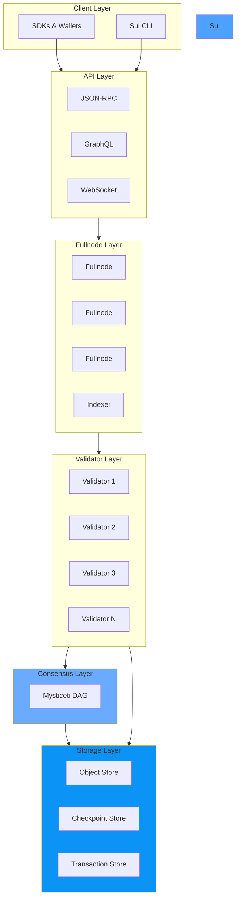
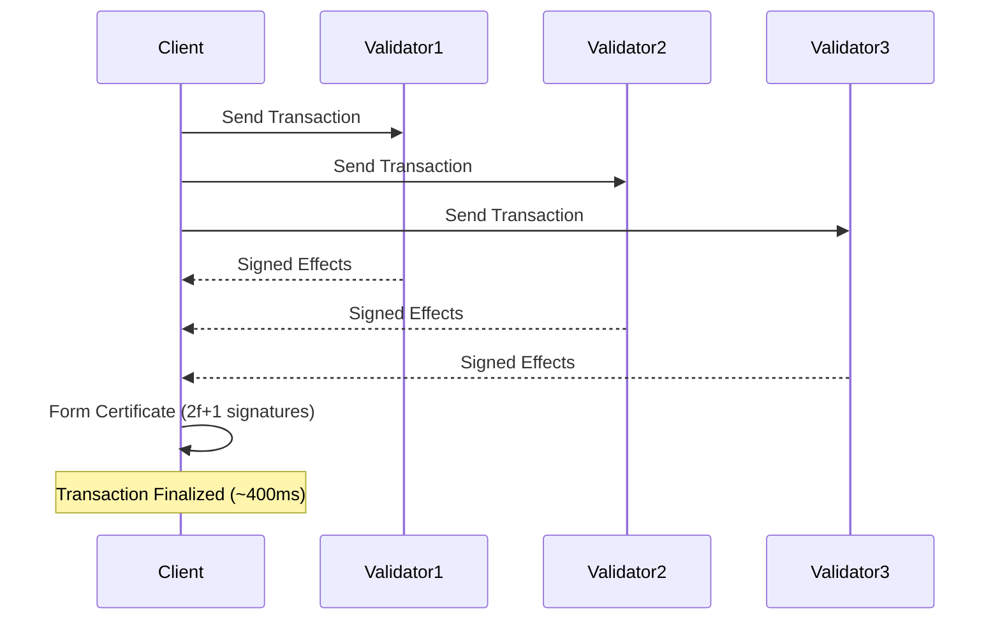
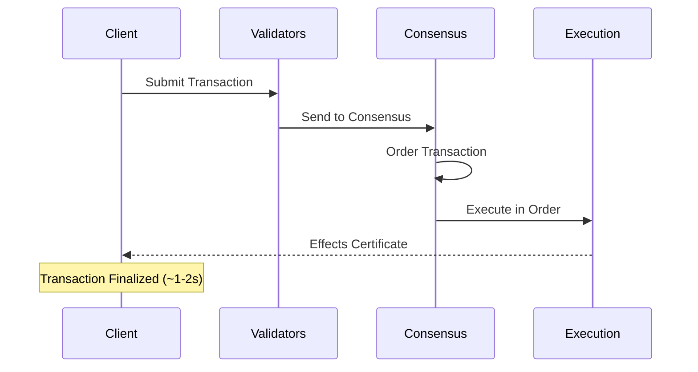

## System Architecture

Sui is a distributed ledger that stores programmable objects with globally unique IDs. Each object is owned, and each object has a type.



## Core Components

### Objects

The fundamental unit of storage in Sui. Every piece of data is represented as an object.

<CardGroup cols={2}>
  <Card title="Owned Objects" icon="user">
    Belong to a single address, enable fast-path execution
  </Card>
  <Card title="Shared Objects" icon="users">
    Accessible by multiple addresses, require consensus
  </Card>
  <Card title="Immutable Objects" icon="lock">
    Read-only data that never changes
  </Card>
  <Card title="Wrapped Objects" icon="box">
    Contained within another object's fields
  </Card>
</CardGroup>

**Object Structure:**

```rust
pub struct Object {
    /// Unique identifier
    pub id: ObjectID,
    /// Version number (increments on each update)
    pub version: SequenceNumber,
    /// Hash of the transaction that created this version
    pub previous_transaction: TransactionDigest,
    /// Owner of this object
    pub owner: Owner,
    /// BCS-serialized Move value
    pub data: Data,
}
```

### Validators

Validators are the backbone of the Sui network, responsible for:

<Accordion title="Transaction Processing">
  - Receive and validate transactions from clients
  - Execute Move code in the Move VM
  - Update object versions and ownership
  - Return signed effects certificates
</Accordion>

<Accordion title="Consensus Participation">
  - Propose blocks containing transactions
  - Vote on block validity
  - Determine transaction ordering
  - Ensure Byzantine fault tolerance (2f+1 quorum)
</Accordion>

<Accordion title="Checkpoint Creation">
  - Aggregate transaction effects into checkpoints
  - Sign checkpoint contents
  - Broadcast to other validators and fullnodes
  - Enable state synchronization
</Accordion>

**Validator Requirements:**
- Minimum 30M SUI stake (for mainnet)
- High-performance hardware (48+ cores, 256GB RAM, NVMe SSD)
- Low-latency network connection (less than 100ms to peers)
- Run `sui-node` binary with validator configuration

### Fullnodes

Fullnodes serve the network but don't participate in consensus.

<Steps>
  <Step title="Sync State">
    Download and verify checkpoints from validators to stay up-to-date.
  </Step>
  <Step title="Serve RPCs">
    Provide JSON-RPC and GraphQL APIs for clients to query and submit transactions.
  </Step>
  <Step title="Index Data">
    Optionally run indexer to enable rich queries and event subscriptions.
  </Step>
</Steps>

## Transaction Flow

### Fast Path (Owned Objects)

For transactions that only touch owned objects (no sharing):



<Info>
Fast path bypasses consensus entirely, achieving finality in a single round of communication.
</Info>

### Consensus Path (Shared Objects)

For transactions that access shared objects:



### Transaction Lifecycle

<Tabs>
  <Tab title="1. Creation">
    ```typescript
    const tx = new Transaction();
    tx.moveCall({
      target: '0x2::coin::transfer',
      arguments: [coin, recipient],
    });
    ```
    Client creates a transaction with commands.
  </Tab>
  <Tab title="2. Signing">
    ```typescript
    const signedTx = await wallet.signTransaction(tx);
    ```
    User signs the transaction with their private key.
  </Tab>
  <Tab title="3. Submission">
    ```typescript
    const result = await client.executeTransaction(signedTx);
    ```
    Transaction is broadcast to validators.
  </Tab>
  <Tab title="4. Validation">
    ```
    - Check signature validity
    - Verify gas payment
    - Check object versions
    - Validate Move bytecode
    ```
    Validators perform safety checks.
  </Tab>
  <Tab title="5. Execution">
    ```
    - Load objects from storage
    - Execute in Move VM
    - Generate effects (updates, deletes, creates)
    - Calculate gas charges
    ```
    Transaction executes in deterministic environment.
  </Tab>
  <Tab title="6. Finalization">
    ```
    - Update object store
    - Record in checkpoint
    - Emit events
    - Return certificate to client
    ```
    Changes are committed and confirmed.
  </Tab>
</Tabs>

## Consensus Protocol

### Mysticeti Overview

Sui uses Mysticeti, a cutting-edge DAG-based Byzantine Fault Tolerant consensus protocol.

<CardGroup cols={2}>
  <Card title="DAG Structure" icon="diagram-project">
    Blocks form a directed acyclic graph, not a linear chain
  </Card>
  <Card title="Leader-Based Commits" icon="crown">
    Even rounds have leaders that trigger commits
  </Card>
  <Card title="Pipelining" icon="arrows-left-right">
    Multiple rounds process simultaneously
  </Card>
  <Card title="Fast Finality" icon="bolt">
    Commits in 2-3 network round-trips (~500ms)
  </Card>
</CardGroup>

**Key Properties:**
- **Safety**: Never commits conflicting transactions
- **Liveness**: Always makes progress (given 2f+1 honest validators)
- **Throughput**: Scales with validator hardware and network bandwidth
- **Latency**: Minimizes time to finality

### Block Structure

```rust
pub struct Block {
    /// Round number
    pub round: Round,
    /// Author (validator) that created this block
    pub author: AuthorityIndex,
    /// Timestamp when block was created
    pub timestamp_ms: u64,
    /// References to previous round blocks
    pub ancestors: Vec<BlockRef>,
    /// Transactions included in this block
    pub transactions: Vec<Transaction>,
}
```

## Storage Architecture

### Multi-Tier Storage

Sui employs a sophisticated storage architecture:

<Accordion title="Authority Store (Perpetual)">
  Persistent RocksDB database containing:
  - Current object versions
  - Transaction history
  - Effects and events
  - Signatures and certificates
  
  **Never deleted**, enables full history replay.
</Accordion>

<Accordion title="Execution Cache">
  In-memory cache for hot objects:
  - Recently accessed objects
  - Pending transactions
  - Temporary execution state
  
  **Improves performance** by reducing disk I/O.
</Accordion>

<Accordion title="Checkpoint Store">
  Finalized checkpoint data:
  - Checkpoint summaries
  - Contents (transaction digests)
  - Signatures from validators
  
  **Enables state sync** for new nodes.
</Accordion>

### Object Versioning

Each object update creates a new version:

```
Object ID: 0xabc123
├─ Version 1 (Created)   @ Tx 0x111
├─ Version 2 (Updated)   @ Tx 0x222
├─ Version 3 (Updated)   @ Tx 0x333
└─ Version 4 (Deleted)   @ Tx 0x444
```

<Warning>
Concurrent updates to the same object version are rejected - only one succeeds.
</Warning>

## Gas and Economics

### Gas Model

<CardGroup cols={2}>
  <Card title="Computation Gas" icon="microchip">
    Based on instructions executed in Move VM
  </Card>
  <Card title="Storage Gas" icon="database">
    One-time fee for storing new objects
  </Card>
  <Card title="Storage Rebate" icon="hand-holding-dollar">
    Partial refund when deleting objects
  </Card>
  <Card title="Reference Gas Price" icon="coins">
    Minimum price set by validators each epoch
  </Card>
</CardGroup>

**Gas Calculation:**

```
Total Gas = Computation Gas + Storage Gas - Storage Rebate

Computation Gas = Σ(instructions × instruction_cost)
Storage Gas = object_size_bytes × storage_price
Storage Rebate = deleted_object_size × rebate_rate
```

### Storage Fund

The storage fund ensures long-term sustainability:

1. **Inflows**: Storage gas fees from object creation
2. **Staking**: Fund is staked to earn rewards
3. **Outflows**: Rebates when objects are deleted
4. **Growth**: Accumulates over time as network grows

## Network Topology

### Validator Network

Validators communicate via two networks:

<Tabs>
  <Tab title="Consensus Network">
    - **Purpose**: Mysticeti consensus protocol
    - **Protocol**: Anemo (custom RPC framework)
    - **Topology**: Fully connected mesh
    - **Requirement**: Low latency (less than 100ms)
  </Tab>
  <Tab title="State Sync Network">
    - **Purpose**: Checkpoint distribution
    - **Protocol**: Anemo with gossip
    - **Topology**: Random peer sampling
    - **Requirement**: High bandwidth
  </Tab>
</Tabs>

### Client Connectivity

Clients connect to fullnodes (not validators directly):

```
[Client] → [Fullnode RPC] → [Validators]
                ↓
         [Indexer/GraphQL]
```

## Epochs and Reconfiguration

### Epoch Lifecycle

An epoch is a period of validator operation (typically 24 hours).

<Steps>
  <Step title="Epoch Start">
    - New validator set activates
    - Staking positions locked
    - Reference gas price set
    - Protocol version determined
  </Step>
  <Step title="Normal Operation">
    - Process transactions
    - Create checkpoints
    - Accumulate rewards
    - Track validator performance
  </Step>
  <Step title="Epoch End">
    - Final checkpoint created
    - Rewards calculated and distributed
    - Next validator set determined
    - State transition to next epoch
  </Step>
</Steps>

### Validator Selection

For the next epoch:

1. **Stake Calculation**: Sum delegation to each validator
2. **Threshold**: Must meet minimum stake requirement
3. **Committee Formation**: Select validators with voting power proportional to stake
4. **Activation**: New committee activates at epoch boundary

## Security Model

### Byzantine Fault Tolerance

Sui tolerates up to f Byzantine (malicious) validators out of 3f+1 total:

<Note>
**Safety threshold**: >2f+1 honest validators (⅔ of stake)  
**Liveness threshold**: >2f+1 responsive validators (⅔ of stake)
</Note>

**Example** (100M total stake):
- f = 33M stake can be faulty
- 67M stake needed for quorum
- Network secure if less than 33M stake is Byzantine

### Attack Resistance

<CardGroup cols={2}>
  <Card title="Double Spend" icon="ban">
    Prevented by object versioning and quorum requirements
  </Card>
  <Card title="Equivocation" icon="copy">
    Detected via cryptographic signatures
  </Card>
  <Card title="Denial of Service" icon="shield">
    Mitigated by gas fees and rate limiting
  </Card>
  <Card title="Sybil Attack" icon="users-slash">
    Prevented by stake requirements
  </Card>
</CardGroup>

## Developer Tools

### Move VM

The Move Virtual Machine executes smart contracts:

- **Bytecode Verifier**: Ensures type safety and resource safety
- **Interpreter**: Executes Move instructions
- **Gas Metering**: Tracks execution costs
- **Deterministic**: Same inputs always produce same outputs

### Indexer

PostgreSQL-based indexer for rich queries:

```sql
-- Query all NFTs owned by an address
SELECT object_id, object_type, version
FROM objects
WHERE owner = '0x123...'
  AND object_type LIKE '%::nft::%';
```

Supports:
- Object queries by owner, type, or field values
- Event filtering and subscriptions
- Transaction history
- Package and module discovery

## Next Steps

<CardGroup cols={2}>
  <Card title="Sui Architecture Deep Dive" icon="magnifying-glass" href="/concepts/sui-architecture">
    Detailed technical architecture
  </Card>
  <Card title="Consensus Protocol" icon="handshake" href="/concepts/consensus">
    Learn about Mysticeti consensus
  </Card>
  <Card title="Objects & Ownership" icon="cube" href="/concepts/objects">
    Understand Sui's object model
  </Card>
  <Card title="Transactions" icon="arrow-right-arrow-left" href="/concepts/transactions">
    Transaction structure and lifecycle
  </Card>
</CardGroup>
