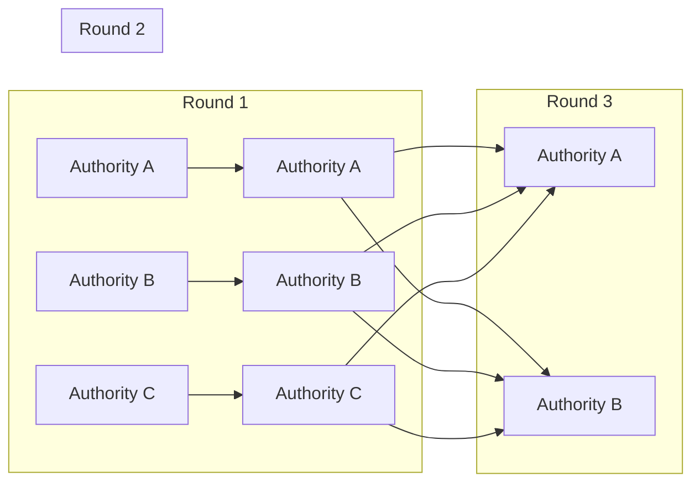
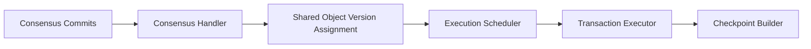

Sui uses the **Mysticeti consensus protocol**, a high-performance DAG-based Byzantine Fault Tolerant (BFT) consensus designed specifically for blockchain applications. Mysticeti provides fast finality and high throughput while maintaining strong safety guarantees.

<Info>
Mysticeti is based on the research paper ["Mysticeti: Low-Latency DAG Consensus"](https://arxiv.org/pdf/2310.14821) and represents a significant advancement in consensus protocol design.
</Info>

## Consensus Overview

Mysticeti achieves consensus by building a Directed Acyclic Graph (DAG) of blocks, where validators propose blocks that reference previous blocks from other validators.



## Core Components

### Authority Node

The `AuthorityNode` manages the consensus protocol execution for each validator:

```rust
// From consensus/core/src/authority_node.rs
pub struct AuthorityNode<N> {
    context: Arc<Context>,
    transaction_client: Arc<TransactionClient>,
    synchronizer: Arc<SynchronizerHandle>,
    core_thread_handle: CoreThreadHandle,
    // ... other components
}
```

Key components:
- **Context**: Committee configuration and protocol parameters
- **Core**: DAG construction and commit decision logic
- **Block Manager**: Validates and stores blocks
- **Synchronizer**: Fetches missing blocks from peers

### Core Logic

The `Core` is the heart of consensus, responsible for:

- **Block Proposal**: Creating new blocks with transactions and ancestor references
- **Block Validation**: Verifying signatures and DAG structure
- **Commit Decisions**: Determining when blocks are finalized
- **Leader Election**: Selecting leaders for each round

```rust
// From consensus/core/src/core.rs
pub struct Core {
    context: Arc<Context>,
    block_manager: BlockManager,
    committer: UniversalCommitter,
    leader_schedule: Arc<LeaderSchedule>,
    dag_state: Arc<RwLock<DagState>>,
    // ... other fields
}
```

## Block Structure

Blocks are the fundamental units of the DAG, containing transactions and references to ancestor blocks.

### Block Format

```rust
// From consensus/core/src/block.rs
pub struct Block {
    epoch: Epoch,
    round: Round,
    author: AuthorityIndex,
    timestamp_ms: BlockTimestampMs,
    ancestors: Vec<BlockRef>,  // References to blocks from previous rounds
    transactions: Vec<Transaction>,
    commit_votes: Vec<CommitVote>,
    // ...
}
```

### Block Fields

- **Epoch**: The consensus epoch (increments with validator set changes)
- **Round**: The consensus round number (monotonically increasing)
- **Author**: Index of the validator that created the block
- **Ancestors**: References to blocks from the previous round(s)
- **Transactions**: Sui transactions to be ordered and executed
- **Commit Votes**: Votes on previously committed sub-DAGs

<Note>
Each block is signed by its author using their protocol keypair, ensuring authenticity and non-repudiation.
</Note>

## DAG Construction

### Block Proposal

Validators propose blocks periodically, following these rules:

1. **Round Progression**: Only advance to round `r` after receiving a quorum of blocks from round `r-1`
2. **Ancestor Selection**: Include references to blocks from previous rounds
3. **Transaction Inclusion**: Add pending transactions from the transaction pool
4. **Causal History**: Ensure all referenced ancestors form a valid DAG

### Ancestor State Management

The `AncestorStateManager` tracks block quality and decides which blocks to reference:

```rust
// Evaluates authority behavior based on block propagation
pub struct AncestorStateManager {
    context: Arc<Context>,
    dag_state: Arc<RwLock<DagState>>,
    propagation_scores: Vec<u64>,
}
```

Validators with poor block propagation may be excluded from ancestor references, incentivizing good behavior.

## Commit Protocol

### Universal Committer

The `UniversalCommitter` implements the commit decision logic:

```rust
pub struct UniversalCommitter {
    context: Arc<Context>,
    leader_schedule: Arc<LeaderSchedule>,
    dag_state: Arc<RwLock<DagState>>,
    number_of_leaders: usize,
    pipeline: bool,
}
```

### Leader-Based Commits

Mysticeti uses a leader-based approach to finalize blocks:

1. **Leader Election**: Each round has one or more designated leaders
2. **Leader Blocks**: Validators propose leader blocks at specific rounds
3. **Quorum Formation**: A leader block becomes committed when it has a quorum of support
4. **Causal Ordering**: All blocks causally preceding a committed leader are also committed

<Tip>
Mysticeti can support multiple leaders per round for increased throughput, configurable via `mysticeti_num_leaders_per_round`.
</Tip>

### Commit Voting

Validators exchange commit votes to signal agreement on committed sub-DAGs:

```rust
pub struct CommitVote {
    // Index of the committed leader
    leader_slot: Slot,
    // Digest of the committed sub-DAG
    commit_digest: CommitDigest,
}
```

Commit votes are included in subsequent blocks to propagate commit decisions across the network.

## Transaction Ordering

Once blocks are committed, transactions within them must be ordered for execution:

### Causal Order

The `CausalOrder` component deterministically orders transactions from committed blocks:

```rust
// From crates/sui-core/src/checkpoints/causal_order.rs
pub struct CausalOrder {
    // Ensures deterministic ordering across all validators
}
```

Ordering guarantees:
- **Deterministic**: All validators produce the same order
- **Causal**: Dependencies are respected (parent transactions before children)
- **Fair**: Transactions are ordered to prevent starvation

### Integration with Sui

Consensus-ordered transactions flow to the Consensus Handler:



## Network Communication

### Block Streaming

Mysticeti uses efficient block streaming to minimize latency:

- **Push-Based**: Validators proactively push new blocks to peers
- **Batching**: Multiple blocks can be sent in a single message
- **Compression**: Block data is compressed for bandwidth efficiency

### Synchronization

The `Synchronizer` ensures validators stay up-to-date:

```rust
pub struct Synchronizer {
    context: Arc<Context>,
    network_client: Arc<NetworkClient>,
    dag_state: Arc<RwLock<DagState>>,
}
```

When missing blocks are detected, the synchronizer:
1. Identifies missing block references
2. Requests blocks from peers
3. Validates received blocks
4. Integrates blocks into the local DAG

## Performance Optimizations

### Pipelining

Mysticeti pipelines commit decisions to reduce latency:

- Multiple rounds can have uncommitted leaders simultaneously
- Commit decisions are made as soon as quorum conditions are met
- No waiting for explicit acknowledgment before proposing new blocks

### Propagation Delay Tracking

The protocol monitors block propagation delays:

```rust
// From consensus/core/src/core.rs
struct Core {
    // Estimated delay for blocks to reach quorum
    propagation_delay: Round,
    // ...
}
```

If propagation delay exceeds thresholds, the validator may pause proposals to prevent wasted work.

### Misbehavior Detection

The protocol detects and reports misbehavior:

```rust
pub struct MisbehaviorReport {
    reporter: AuthorityIndex,
    reported: AuthorityIndex,
    evidence: MisbehaviorEvidence,
}
```

Types of misbehavior:
- **Equivocation**: Proposing multiple blocks for the same round
- **Invalid References**: Referencing non-existent or invalid blocks
- **Signature Errors**: Blocks with invalid signatures

## Committee Configuration

The consensus committee defines the validator set:

```rust
// From consensus/config/src/committee.rs
pub struct Committee {
    epoch: Epoch,
    total_stake: Stake,
    quorum_threshold: Stake,  // 2f+1
    validity_threshold: Stake, // f+1
    authorities: Vec<Authority>,
}
```

### Stake-Weighted Voting

Consensus decisions are based on stake weights:

- **Quorum**: 2f+1 stake (Byzantine fault tolerance)
- **Validity**: f+1 stake (weak quorum)
- **Total Stake**: Sum of all validator stakes (typically 10,000 basis points)

<Info>
The committee configuration is recalculated at the start of each epoch based on staking changes.
</Info>

## Consensus to Execution

Consensus output flows to the Consensus Handler:

```rust
// From crates/sui-core/src/consensus_handler.rs
pub struct SequencedConsensusTransaction {
    consensus_output: ConsensusCommitInfo,
    transaction: ConsensusTransaction,
    certificate_author_index: AuthorityIndex,
}
```

The handler:
1. Processes committed consensus output
2. Assigns versions to shared objects
3. Schedules transactions for execution
4. Builds checkpoints from executed transactions

## Key Implementation Files

- Authority Node: `consensus/core/src/authority_node.rs`
- Core Logic: `consensus/core/src/core.rs`
- Block Types: `consensus/core/src/block.rs`
- Committer: `consensus/core/src/universal_committer/`
- Committee: `consensus/config/src/committee.rs`
- DAG State: `consensus/core/src/dag_state.rs`

## Related Topics

- [Sui Architecture](./sui-architecture)
- [Validators](./validators)
- [Epochs and Checkpoints](./epochs-checkpoints)
