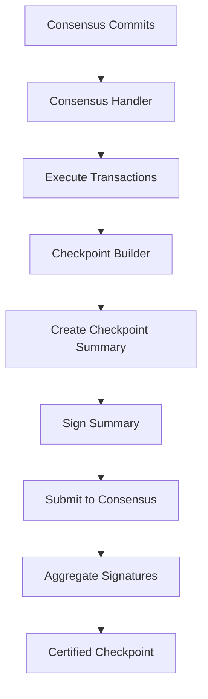
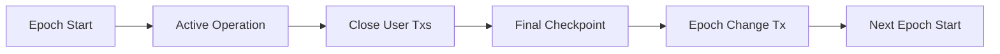
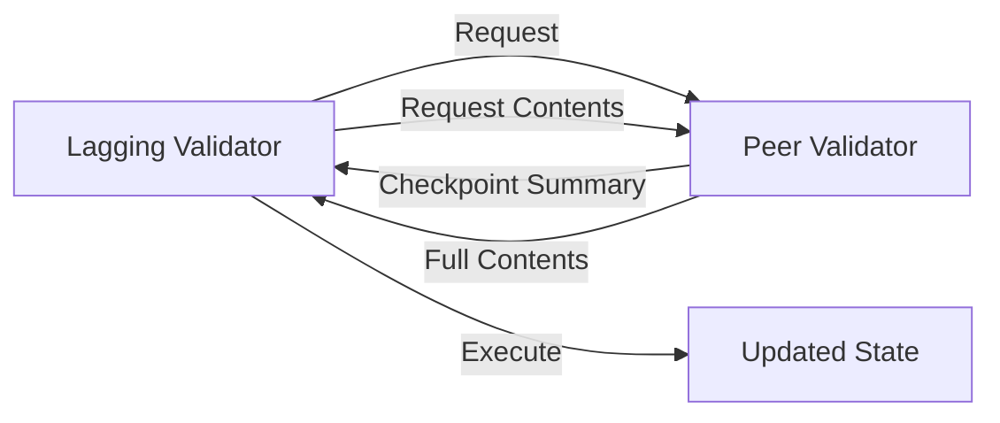

Sui uses a dual-layer finalization system: **checkpoints** provide fast, frequent state commitments, while **epochs** organize longer time periods for validator set changes and protocol upgrades.

## Checkpoints

Checkpoints are Sui's primary finalization mechanism, providing certified snapshots of the blockchain state at regular intervals.

### Purpose of Checkpoints

Checkpoints serve multiple critical functions:

- **State Finalization**: Provide cryptographic commitments to executed transactions
- **Fast Synchronization**: Enable new validators and full nodes to catch up efficiently
- **Light Clients**: Support verification without executing all transactions
- **Archival**: Create immutable historical records for auditing and replay

### Checkpoint Structure

```rust
// From sui-types/src/messages_checkpoint.rs
pub struct CheckpointSummary {
    epoch: EpochId,
    sequence_number: CheckpointSequenceNumber,
    network_total_transactions: u64,
    content_digest: CheckpointContentsDigest,
    previous_digest: Option<CheckpointDigest>,
    epoch_rolling_gas_cost_summary: GasCostSummary,
    timestamp_ms: CheckpointTimestamp,
    // Commitment to all live objects
    checkpoint_commitments: Vec<CheckpointCommitment>,
    // ...
}
```

### Checkpoint Contents

Each checkpoint includes all transactions finalized since the previous checkpoint:

```rust
pub struct CheckpointContents {
    transactions: Vec<ExecutionDigests>,
}

pub struct ExecutionDigests {
    transaction: TransactionDigest,
    effects: TransactionEffectsDigest,
}
```

<Info>
Checkpoint contents are stored separately from the summary, allowing efficient summary-only verification for light clients.
</Info>

## Checkpoint Creation Process

### Building Checkpoints

Validators continuously build checkpoints from executed transactions:



### Checkpoint Builder

The `CheckpointBuilder` orchestrates checkpoint creation:

```rust
// From crates/sui-core/src/checkpoints/mod.rs
pub struct PendingCheckpoint {
    roots: Vec<TransactionKey>,
    details: PendingCheckpointInfo,
}

pub struct PendingCheckpointInfo {
    timestamp_ms: CheckpointTimestamp,
    last_of_epoch: bool,
    checkpoint_height: CheckpointHeight,
    consensus_commit_ref: CommitRef,
    // ...
}
```

Building steps:

1. **Transaction Execution**: Execute consensus-ordered transactions
2. **Content Collection**: Gather transaction and effects digests
3. **State Commitment**: Compute accumulator root over live objects
4. **Summary Creation**: Build checkpoint summary with metadata
5. **Signing**: Sign summary with validator's key

### Checkpoint Signature Aggregation

Validators submit their checkpoint signatures to consensus:

```rust
// From crates/sui-core/src/checkpoints/checkpoint_output.rs
impl CheckpointOutput for SubmitCheckpointToConsensus {
    async fn checkpoint_created(
        &self,
        summary: &CheckpointSummary,
        contents: &CheckpointContents,
        epoch_store: &Arc<AuthorityPerEpochStore>,
        checkpoint_store: &Arc<CheckpointStore>,
    ) -> SuiResult {
        // Sign the checkpoint
        let summary = SignedCheckpointSummary::new(
            epoch_store.epoch(),
            summary.clone(),
            &*self.signer,
            self.authority,
        );
        
        // Submit signature to consensus
        let transaction = ConsensusTransaction::new_checkpoint_signature_message(summary);
        self.sender.submit_to_consensus(&[transaction], epoch_store)?;
        // ...
    }
}
```

Signature collection:
1. Validators create and sign checkpoint summaries locally
2. Signatures are submitted as consensus transactions
3. Validators collect signatures from consensus output
4. Once 2f+1 stake worth of signatures are collected, checkpoint is certified

### Certified Checkpoints

A checkpoint becomes certified when it has a quorum of validator signatures:

```rust
pub struct CertifiedCheckpointSummary {
    summary: CheckpointSummary,
    auth_sig: AuthorityStrongQuorumSignInfo,
}
```

Certification guarantees:
- **Immutability**: Checkpoint contents cannot be changed
- **Finality**: All included transactions are permanently ordered
- **Network Agreement**: A quorum of validators agree on the state

<Note>
Certified checkpoints are stored in the `CheckpointStore` at `crates/sui-core/src/checkpoints/mod.rs:156-200`.
</Note>

## Checkpoint Storage

The `CheckpointStore` maintains checkpoint data:

```rust
// From crates/sui-core/src/checkpoints/mod.rs
pub struct CheckpointStoreTables {
    // Maps checkpoint contents digest to checkpoint contents
    checkpoint_content: DBMap<CheckpointContentsDigest, CheckpointContents>,
    
    // Stores certified checkpoints by sequence number
    certified_checkpoints: DBMap<CheckpointSequenceNumber, TrustedCheckpoint>,
    
    // Maps checkpoint digest to certified checkpoint
    checkpoint_by_digest: DBMap<CheckpointDigest, TrustedCheckpoint>,
    
    // Maps epoch ID to last checkpoint in that epoch
    epoch_last_checkpoint_map: DBMap<EpochId, CheckpointSequenceNumber>,
    
    // Watermarks for checkpoint progress
    watermarks: DBMap<CheckpointWatermark, (CheckpointSequenceNumber, CheckpointDigest)>,
    // ...
}
```

### Checkpoint Watermarks

Watermarks track checkpoint processing progress:

- **Highest Verified**: Latest checkpoint with verified signatures
- **Highest Synced**: Latest checkpoint with downloaded contents
- **Highest Executed**: Latest checkpoint with executed transactions

### Full Checkpoint Contents

For state synchronization, full checkpoint contents include:

```rust
pub struct FullCheckpointContents {
    transactions: Vec<TransactionEffects>,
    user_signatures: Vec<Vec<GenericSignature>>,
}
```

This enables validators to:
- Download complete checkpoint data
- Verify all transactions and effects
- Apply state changes without re-execution

## Epochs

Epochs are fixed-duration periods that organize validator set changes and protocol upgrades.

### Epoch Structure

```rust
// From sui-types/src/epoch_data.rs
pub struct EpochData {
    epoch_id: EpochId,
    epoch_start_timestamp: CheckpointTimestamp,
    epoch_digest: CheckpointDigest,
}
```

Each epoch has:
- **Epoch ID**: Sequential number starting from 0 (genesis)
- **Start Timestamp**: Wall clock time when epoch began
- **Epoch Digest**: Digest of the last checkpoint from previous epoch
- **Duration**: Typically 24 hours (configurable)

### Epoch Lifecycle



### Epoch Start

At the beginning of each epoch:

1. **Load System State**: Read epoch start configuration from previous epoch's final checkpoint
2. **Initialize Committee**: Create committee from validator set
3. **Configure Protocol**: Load protocol version and parameters
4. **Start Consensus**: Initialize consensus with new committee
5. **Open for Transactions**: Begin accepting user transactions

```rust
// From crates/sui-core/src/authority/epoch_start_configuration.rs
pub struct EpochStartConfiguration {
    system_state: EpochStartSystemState,
    epoch_digest: CheckpointDigest,
    flags: Vec<EpochFlag>,
}
```

### Epoch Operation

During normal epoch operation:

- Validators process transactions through consensus
- Checkpoints are created every few seconds
- Staking operations are recorded but not applied
- Protocol operates under consistent rules

### Epoch End

As the epoch approaches its end (based on timestamp):

1. **Close User Transactions**: Stop accepting new user-submitted transactions
2. **Process Remaining**: Complete all in-flight consensus transactions
3. **Build Final Checkpoint**: Create the last checkpoint of the epoch
4. **Safe Mode Check**: Determine if epoch should enter safe mode
5. **Execute Epoch Change**: Run system transaction to transition to next epoch

<Tip>
Epoch changes are triggered by timestamp rather than checkpoint number, ensuring predictable epoch durations.
</Tip>

### End-of-Epoch Data

The final checkpoint of an epoch includes special end-of-epoch data:

```rust
pub struct EndOfEpochData {
    // Validators for the next epoch
    next_epoch_committee: Vec<(AuthorityName, StakeUnit)>,
    
    // Protocol version for next epoch
    next_epoch_protocol_version: ProtocolVersion,
    
    // Epoch change transaction effects
    epoch_commitments: Vec<CheckpointCommitment>,
}
```

## Epoch Statistics

Epochs accumulate statistics during their lifetime:

```rust
// From crates/sui-core/src/checkpoints/mod.rs
pub struct EpochStats {
    pub checkpoint_count: u64,
    pub transaction_count: u64,
    pub total_gas_reward: u64,
}
```

Tracked metrics:
- Total checkpoints created
- Total transactions processed
- Total gas fees collected
- Stake rewards distributed

## State Synchronization

Checkpoints enable efficient state synchronization for validators and full nodes.

### Checkpoint Execution

The `CheckpointExecutor` applies checkpoints to build state:

```rust
// From crates/sui-core/src/checkpoints/checkpoint_executor
pub struct CheckpointExecutor {
    checkpoint_store: Arc<CheckpointStore>,
    execution_cache: Arc<dyn ExecutionCacheWrite>,
    state: Arc<AuthorityState>,
    // ...
}
```

Execution process:
1. **Download Checkpoint**: Fetch certified checkpoint and full contents
2. **Verify Signature**: Validate quorum signatures on summary
3. **Execute Transactions**: Apply transaction effects to state
4. **Update Accumulator**: Recompute state commitments
5. **Advance Watermark**: Mark checkpoint as executed

### State Sync Protocol

Validators synchronize through the state sync network:



### Checkpoint Pruning

Older checkpoint data can be pruned to save storage:

- **Full Contents**: Pruned after state is executed (configurable retention)
- **Summaries**: Retained indefinitely (small size)
- **Watermarks**: Track what can be safely pruned

<Info>
Pruning configuration is managed by `AuthorityStorePruner` and `PrunerWatermarks`.
</Info>

## Checkpoint Height

Checkpoint height represents the consensus round that produced the checkpoint:

```rust
pub type CheckpointHeight = u64;

pub struct PendingCheckpointInfo {
    checkpoint_height: CheckpointHeight,
    consensus_commit_ref: CommitRef,
    // ...
}
```

Checkpoint height:
- Derived from consensus commit round
- May not be strictly monotonic (due to checkpoint splitting)
- Used for consensus coordination

## Fork Detection

Checkpoints enable detection of forks and inconsistencies:

```rust
// From crates/sui-core/src/checkpoints/mod.rs
pub struct CheckpointStoreTables {
    // Stores local checkpoint computations for fork detection
    locally_computed_checkpoints: DBMap<CheckpointSequenceNumber, CheckpointSummary>,
    
    // Stores transaction fork detection information
    transaction_fork_detected: DBMap<u8, (TransactionDigest, TransactionEffectsDigest, TransactionEffectsDigest)>,
}
```

Fork detection:
1. Validators compute checkpoint summaries locally
2. Compare local summary with certified summary
3. If mismatch detected, log fork information
4. Store evidence for investigation

## Performance Considerations

### Checkpoint Frequency

Checkpoints are created approximately every:
- **2-3 seconds** during normal operation
- Determined by consensus commit rate
- Configurable through protocol parameters

### Checkpoint Size

Checkpoint size varies based on transaction throughput:
- **Summary**: ~500 bytes (fixed)
- **Contents**: ~100 bytes per transaction
- **Full Contents**: ~1-5 KB per transaction (includes effects)

### State Sync Performance

Checkpoint-based state sync achieves:
- **Download Rate**: Limited by network bandwidth
- **Execution Rate**: Limited by database write speed
- **Catch-up Time**: Typically minutes to hours depending on lag

## Key Implementation Files

- Checkpoint Types: `crates/sui-types/src/messages_checkpoint.rs`
- Checkpoint Store: `crates/sui-core/src/checkpoints/mod.rs`
- Checkpoint Builder: `crates/sui-core/src/checkpoints/checkpoint_output.rs`
- Checkpoint Executor: `crates/sui-core/src/checkpoints/checkpoint_executor/`
- Epoch Data: `crates/sui-types/src/epoch_data.rs`
- Epoch Store: `crates/sui-core/src/authority/authority_per_epoch_store.rs`
- Committee Store: `crates/sui-core/src/epoch/committee_store.rs`

## Related Topics

- [Sui Architecture](./sui-architecture)
- [Consensus Mechanism](./consensus)
- [Validators](./validators)
