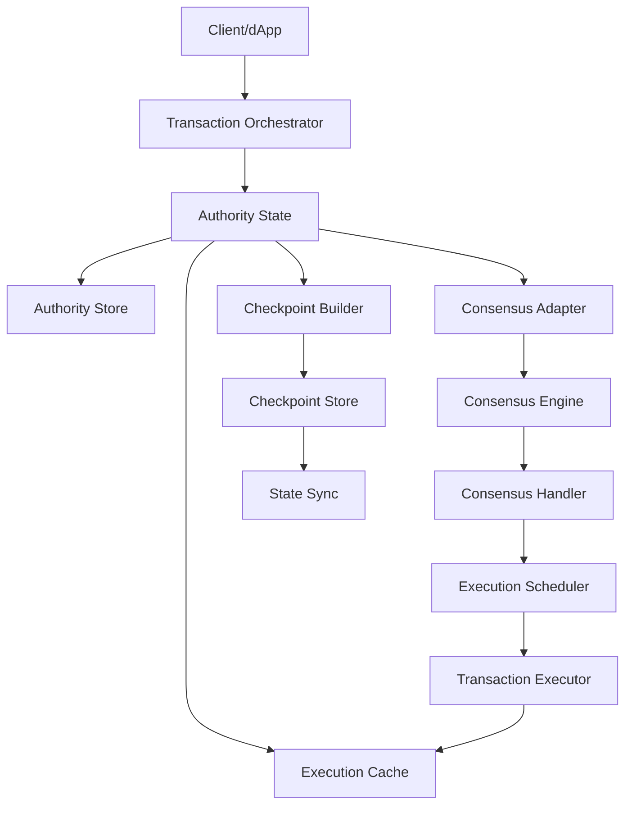

Sui is a high-performance blockchain designed for low-latency transactions and parallel execution. Its architecture is built around a validator network that processes transactions through a sophisticated DAG-based consensus mechanism.

## Core Components

Sui's architecture consists of several interconnected layers that work together to process and finalize transactions:



## Authority State

The `AuthorityState` is the central component of a Sui validator node. It manages transaction processing, object storage, and coordination with consensus.

<Note>
The AuthorityState is defined in `crates/sui-core/src/authority.rs` and serves as the primary interface for transaction execution and validation.
</Note>

### Key Responsibilities

- **Transaction Validation**: Verifies transaction signatures, checks object ownership, and validates gas budgets
- **Object Management**: Tracks object versions and ownership through the Authority Store
- **Execution Coordination**: Routes transactions to the appropriate execution path (simple vs. consensus)
- **Checkpoint Participation**: Signs and aggregates checkpoint summaries

### Per-Epoch Isolation

Sui maintains separate storage per epoch through the `AuthorityPerEpochStore`:

```rust
// From crates/sui-core/src/authority/authority_per_epoch_store.rs
pub struct AuthorityPerEpochStore {
    epoch_id: EpochId,
    committee: Arc<Committee>,
    protocol_config: ProtocolConfig,
    // ... epoch-specific state
}
```

Each epoch has its own:
- Committee configuration
- Protocol version and configuration
- Consensus state
- Transaction processing state

## Storage Architecture

Sui uses a multi-layered storage system optimized for different access patterns:

### Authority Store

Permanent storage for objects, transactions, and effects:

- **Objects Table**: Stores the current version of all objects
- **Transactions Table**: Stores signed transaction data
- **Effects Table**: Stores transaction execution results
- **Locks Table**: Manages object locks for transaction execution

<Info>
The Authority Store uses RocksDB for persistent storage, with custom optimizations for point lookups and range scans.
</Info>

### Execution Cache

The execution cache provides fast access to frequently used data:

```rust
// Provides trait-based access to execution state
pub trait ExecutionCacheTraitPointers {
    fn object_cache_reader(&self) -> &dyn ObjectCacheRead;
    fn transaction_cache_reader(&self) -> &dyn TransactionCacheRead;
}
```

Benefits:
- Reduces database reads for hot objects
- Enables fast transaction lookups
- Supports efficient checkpoint building

### Checkpoint Store

Stores certified checkpoints and their contents:

- Maps checkpoint sequence numbers to certified summaries
- Stores full checkpoint contents for state sync
- Maintains epoch boundaries and watermarks

## Transaction Processing Pipeline

### Simple Transactions

Transactions that only access owned objects can be processed immediately:

1. **Validation**: Check signatures, gas, and object ownership
2. **Execution**: Run the Move transaction and produce effects
3. **Certification**: Collect validator signatures on effects
4. **Finalization**: Update object versions and notify clients

### Consensus Transactions

Transactions accessing shared objects must go through consensus:

1. **Submission**: Client submits transaction to validators
2. **Consensus Ordering**: Transaction is sequenced through the DAG
3. **Scheduling**: Consensus handler assigns object versions
4. **Execution**: Transaction executes with assigned versions
5. **Checkpoint Inclusion**: Results are included in the next checkpoint

<Tip>
Sui's parallel execution model allows multiple transactions to execute simultaneously as long as they don't conflict on shared objects.
</Tip>

## Network Architecture

### Validator Network

Validators communicate through two main networks:

**Consensus Network** (Anemo-based):
- DAG block propagation
- Commit vote exchange
- Low-latency block streaming

**State Sync Network**:
- Checkpoint distribution
- Object synchronization
- Catch-up for slow validators

### Client-Validator Communication

Clients interact with validators through:

- **JSON-RPC**: Read queries and transaction submission
- **gRPC**: High-performance transaction execution API
- **WebSocket**: Real-time event subscriptions

## Execution Model

Sui uses a sophisticated execution scheduler to maximize throughput:

### Parallel Execution

The `ExecutionScheduler` analyzes transaction dependencies and executes non-conflicting transactions in parallel:

```rust
// From crates/sui-core/src/execution_scheduler
pub struct ExecutionScheduler {
    // Tracks object version assignments
    shared_object_version_manager: SharedObjVerManager,
    // Coordinates parallel execution
    executor: Arc<dyn Executor>,
}
```

### Congestion Control

Sui implements per-object congestion tracking to prevent hotspots:

- Monitors transaction throughput per shared object
- Applies backpressure when objects are overloaded
- Defers transactions that would exceed capacity

<Info>
Congestion control is enabled through the `PerObjectCongestionControlMode` protocol configuration.
</Info>

## State Synchronization

Validators synchronize state through checkpoints:

1. **Checkpoint Building**: Validators build checkpoints from executed transactions
2. **Certification**: Validators sign checkpoint summaries
3. **Distribution**: Certified checkpoints are shared across the network
4. **Execution**: Lagging validators execute checkpoint contents to catch up

### Global State Hashing

The `GlobalStateHasher` maintains a cryptographic commitment to the entire object state:

- Uses accumulator-based hashing for efficient updates
- Enables state sync verification
- Supports light client proofs

## Monitoring and Metrics

Sui exposes comprehensive metrics for monitoring:

- **Transaction Metrics**: Throughput, latency, error rates
- **Consensus Metrics**: Round progression, commit latency
- **Storage Metrics**: Database sizes, cache hit rates
- **Network Metrics**: Peer connectivity, message rates

Metrics are exposed via Prometheus and can be visualized using Grafana dashboards.

## Key Implementation Files

- Authority State: `crates/sui-core/src/authority.rs`
- Authority Store: `crates/sui-core/src/authority/authority_store.rs`
- Execution Cache: `crates/sui-core/src/execution_cache/`
- Checkpoint System: `crates/sui-core/src/checkpoints/mod.rs`
- Consensus Integration: `crates/sui-core/src/consensus_adapter.rs`

## Related Topics

- [Consensus Mechanism](./consensus)
- [Validators](./validators)
- [Epochs and Checkpoints](./epochs-checkpoints)
