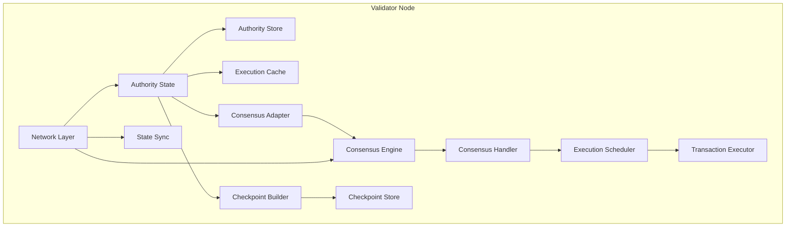

Validators are the backbone of the Sui network, responsible for processing transactions, running consensus, building checkpoints, and maintaining network security through stake-weighted voting.

## Validator Roles

Sui validators perform several critical functions:

### Transaction Processing

Validators receive and process transactions from clients:

- **Validation**: Verify transaction signatures, object ownership, and gas budgets
- **Execution**: Run Move code and produce transaction effects
- **Certification**: Sign transaction effects and aggregate signatures
- **Response**: Return certified results to clients

### Consensus Participation

Validators participate in the Mysticeti consensus protocol:

- **Block Proposal**: Create and broadcast DAG blocks containing transactions
- **Block Validation**: Verify blocks received from other validators
- **Commit Decisions**: Vote on finalizing blocks through the commit protocol
- **Leadership**: Serve as leaders for designated rounds based on stake

### Checkpoint Creation

Validators collaborate to create checkpoints:

- **Checkpoint Building**: Aggregate executed transactions into checkpoint contents
- **Summary Signing**: Sign checkpoint summaries with transaction roots and state commitments
- **Certification**: Collect signatures from other validators to certify checkpoints
- **Distribution**: Share certified checkpoints with the network for state sync

### State Synchronization

Validators help other nodes synchronize state:

- Serve checkpoint data to lagging validators
- Provide transaction and object data for state reconstruction
- Participate in peer-to-peer networks for efficient data distribution

## Validator Components

A Sui validator node consists of multiple integrated components:



### Validator Service

The `ValidatorService` handles incoming requests from other validators and clients:

```rust
// From crates/sui-core/src/authority_server.rs
pub struct ValidatorService {
    state: Arc<AuthorityState>,
    metrics: Arc<ValidatorServiceMetrics>,
}
```

Provides endpoints for:
- Transaction submission
- Object queries
- Checkpoint retrieval
- Validator health checks

### Authority State

The `AuthorityState` is the core of validator operations:

```rust
// Manages all validator state and operations
pub struct AuthorityState {
    name: AuthorityName,
    secret: StableSyncAuthoritySigner,
    epoch_store: ArcSwapOption<AuthorityPerEpochStore>,
    // ... storage and execution components
}
```

<Info>
Each validator has a unique `AuthorityName` derived from its public key, used for identification in the committee.
</Info>

## Committee Membership

Validators are organized into a committee that changes each epoch.

### Committee Structure

```rust
// From sui-types/src/committee.rs
pub struct Committee {
    epoch: EpochId,
    voting_rights: BTreeMap<AuthorityName, StakeUnit>,
    total_votes: StakeUnit,
}
```

The committee defines:
- **Epoch**: The current epoch number
- **Voting Rights**: Stake weight for each validator
- **Quorum Thresholds**: Required stake for consensus decisions (2f+1)

### Validator Information

Each validator in the committee has associated metadata:

```rust
// From sui-types/src/sui_system_state/epoch_start_sui_system_state.rs
pub struct EpochStartValidatorInfoV1 {
    sui_address: SuiAddress,
    authority_pubkey: AuthorityPublicKey,
    protocol_pubkey: Vec<u8>,
    narwhal_worker_pubkey: Vec<u8>,
    narwhal_network_pubkey: NetworkPublicKey,
    voting_power: StakeUnit,
    sui_net_address: Multiaddr,
    narwhal_primary_address: Multiaddr,
    hostname: String,
    // ...
}
```

### Network Addresses

Validators expose multiple network endpoints:

- **Sui Network Address**: For validator-to-validator communication
- **Consensus Address**: For DAG block exchange
- **Public RPC**: For client transaction submission and queries

<Note>
Network addresses are stored on-chain and updated during epoch changes through the SuiSystemState object.
</Note>

## Staking and Voting Power

Validator influence is determined by staked SUI:

### Stake Calculation

Voting power is proportional to total stake:

```
voting_power = (validator_stake / total_network_stake) × 10,000
```

Stake includes:
- **Self-Stake**: SUI staked by the validator operator
- **Delegated Stake**: SUI delegated by other users

### Quorum Requirements

Consensus decisions require stake-weighted quorums:

- **Byzantine Quorum (2f+1)**: Required for checkpoint certification and consensus commits
- **Validity Quorum (f+1)**: Required for weak validity proofs
- **Fault Tolerance (f)**: Maximum Byzantine stake tolerated = (total_stake - 1) / 3

### Stake Updates

Stake changes take effect at epoch boundaries:

1. Staking operations (stake, unstake) are recorded during epoch N
2. Changes are computed in the epoch N change transaction
3. New committee with updated stakes becomes active in epoch N+1

## Per-Epoch Operations

Validators maintain separate state for each epoch through `AuthorityPerEpochStore`:

```rust
// From crates/sui-core/src/authority/authority_per_epoch_store.rs
pub struct AuthorityPerEpochStore {
    epoch_id: EpochId,
    committee: Arc<Committee>,
    protocol_config: ProtocolConfig,
    // Epoch-specific tables and state
}
```

### Epoch Start

At the beginning of each epoch, validators:

1. **Load Configuration**: Read new committee and protocol config
2. **Initialize Consensus**: Start consensus with new parameters
3. **Reset Metrics**: Clear epoch-specific counters
4. **Open for Business**: Begin accepting transactions

### Epoch End

As the epoch approaches its end:

1. **Close User Transactions**: Stop accepting new user-submitted transactions
2. **Drain Consensus**: Process remaining consensus transactions
3. **Final Checkpoint**: Create the last checkpoint of the epoch
4. **State Transition**: Compute end-of-epoch state for next epoch

### Reconfiguration

The epoch change process is managed by `ReconfigState`:

```rust
// From crates/sui-core/src/epoch/reconfiguration.rs
pub enum ReconfigCertStatus {
    AcceptAllCerts,
    RejectUserCerts,
    RejectAllCerts,
    RejectAllTx,
}
```

Reconfiguration phases:
1. **Normal Operation**: Accept all transactions
2. **User Cert Rejection**: Stop accepting user transactions
3. **All Cert Rejection**: Only process system transactions
4. **All Tx Rejection**: Prepare for epoch change

## Validator Operations

### Transaction Submission

Validators accept transactions through multiple paths:

**Direct Submission** (owned objects only):
```
Client → Validator → Execution → Certification → Response
```

**Consensus Submission** (shared objects):
```
Client → Validator → Consensus → Ordering → Execution → Checkpoint
```

### Consensus Adapter

The `ConsensusAdapter` bridges transaction processing and consensus:

```rust
// From crates/sui-core/src/consensus_adapter.rs
pub struct ConsensusAdapter {
    consensus_client: Arc<dyn ConsensusClient>,
    epoch_store: Arc<AuthorityPerEpochStore>,
    // ...
}
```

Responsibilities:
- Submit transactions to consensus
- Monitor consensus health
- Handle congestion control
- Coordinate with checkpoint builder

### Checkpoint Builder

Validators continuously build checkpoints from executed transactions:

```rust
// From crates/sui-core/src/checkpoints/mod.rs
pub struct CheckpointBuilder {
    state: Arc<AuthorityState>,
    epoch_store: Arc<AuthorityPerEpochStore>,
    checkpoint_store: Arc<CheckpointStore>,
    // ...
}
```

Checkpoint building process:
1. **Transaction Execution**: Execute consensus-ordered transactions
2. **Content Aggregation**: Collect executed transaction digests
3. **Summary Creation**: Build checkpoint summary with state roots
4. **Signing**: Sign the checkpoint summary
5. **Submission to Consensus**: Send signature to consensus for aggregation
6. **Certification**: Receive certified checkpoint with quorum signatures

## Validator Metrics and Monitoring

Validators expose comprehensive metrics:

### Transaction Metrics

- **Throughput**: Transactions per second (TPS)
- **Latency**: Time from submission to finalization
- **Error Rate**: Failed transaction percentage
- **Execution Time**: Per-transaction execution duration

### Consensus Metrics

- **Round Number**: Current consensus round
- **Commit Latency**: Time from block proposal to commit
- **Block Propagation**: Time for blocks to reach peers
- **DAG Size**: Number of uncommitted blocks

### Checkpoint Metrics

- **Checkpoint Sequence**: Current checkpoint number
- **Checkpoint Lag**: Difference between executed and certified checkpoints
- **Signature Collection Time**: Time to gather quorum signatures
- **State Sync Progress**: Checkpoint application rate

### Resource Metrics

- **Database Size**: Total storage used
- **Memory Usage**: Heap and cache utilization
- **Network Bandwidth**: Incoming/outgoing traffic
- **CPU Usage**: Execution and validation load

<Tip>
Validators should monitor checkpoint lag closely. Sustained lag indicates the validator is falling behind the network.
</Tip>

## Validator Health Checks

Validators provide health check endpoints:

```rust
// Health check responses indicate validator status
pub struct ValidatorHealthResponse {
    epoch: EpochId,
    highest_known_checkpoint: CheckpointSequenceNumber,
    in_consensus: bool,
}
```

Health indicators:
- **Epoch Match**: Validator is in the correct epoch
- **Checkpoint Sync**: Up-to-date with network checkpoints
- **Consensus Active**: Participating in consensus
- **RPC Responsive**: Handling client requests

## Validator Rewards and Economics

Validators earn rewards for their participation:

### Reward Distribution

At the end of each epoch:
1. **Stake Subsidy**: Newly minted SUI distributed based on stake
2. **Gas Fees**: Collected transaction fees allocated to validators
3. **Commission**: Validators take a percentage before distributing to delegators
4. **Delegator Rewards**: Remaining rewards distributed to stake delegators

### Slashing and Penalties

While Sui does not currently implement slashing, future versions may penalize:
- Prolonged downtime or unavailability
- Provable Byzantine behavior
- Failure to participate in consensus or checkpoints

## Key Implementation Files

- Validator Service: `crates/sui-core/src/authority_server.rs`
- Authority State: `crates/sui-core/src/authority.rs`
- Committee Store: `crates/sui-core/src/epoch/committee_store.rs`
- Per-Epoch Store: `crates/sui-core/src/authority/authority_per_epoch_store.rs`
- Validator Info: `crates/sui-types/src/sui_system_state/epoch_start_sui_system_state.rs`
- Reconfiguration: `crates/sui-core/src/epoch/reconfiguration.rs`

## Related Topics

- [Sui Architecture](./sui-architecture)
- [Consensus Mechanism](./consensus)
- [Epochs and Checkpoints](./epochs-checkpoints)
