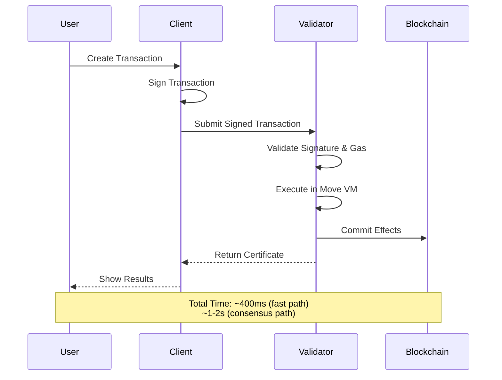

## Overview

This guide walks you through creating and executing your first transaction on Sui, from setting up your wallet to transferring SUI tokens.

<Note>
Make sure you've [installed Sui](/installation) and configured your client before proceeding.
</Note>

## Prerequisites

<Steps>
  <Step title="Verify Sui Installation">
    ```bash
    sui --version
    ```
    
    Expected output: `sui 1.68.0` (or later)
  </Step>

  <Step title="Check Active Environment">
    ```bash
    sui client active-env
    ```
    
    Should show `devnet` (or your preferred network)
  </Step>

  <Step title="View Your Address">
    ```bash
    sui client active-address
    ```
    
    Output: `0x1234...abcd` (your unique address)
  </Step>
</Steps>

## Get Test Tokens

Before you can send transactions, you need SUI tokens to pay for gas.

<Tabs>
  <Tab title="Using CLI">
    ```bash
    sui client faucet
    ```
    
    Expected output:
    ```
    Request successful. It can take up to 1 minute to get the coin.
    Run sui client balance to check your balance.
    ```
    
    Wait a moment, then check your balance:
    ```bash
    sui client balance
    ```
  </Tab>

  <Tab title="Using Web Faucet">
    1. Visit [https://faucet.devnet.sui.io](https://faucet.devnet.sui.io)
    2. Paste your address (from `sui client active-address`)
    3. Click "Request SUI"
    4. Wait ~10 seconds for confirmation
  </Tab>

  <Tab title="Using Discord">
    1. Join [Sui Discord](https://discord.gg/sui)
    2. Go to #devnet-faucet channel
    3. Type: `!faucet <your-address>`
    4. Bot will send you test SUI
  </Tab>
</Tabs>

<Info>
Devnet and testnet faucets provide test tokens with no real value. For mainnet, you'll need to acquire actual SUI.
</Info>

## Transaction Types

Sui supports several transaction types. Let's start with the most common:

### 1. Transfer SUI Tokens

Transfer SUI from your address to another:

<Steps>
  <Step title="Create a Second Address (for testing)">
    ```bash
    sui client new-address ed25519
    ```
    
    Output:
    ```
    Created new keypair and saved to ~/.sui/sui_config/sui.keystore
    New address: 0xabcd...9876
    ```
    
    Save this address - we'll use it as the recipient.
  </Step>

  <Step title="Switch Back to Your Main Address">
    ```bash
    sui client addresses
    ```
    
    This shows all your addresses. Note the one with tokens (from the faucet).
    
    ```bash
    sui client switch --address 0x1234...
    ```
  </Step>

  <Step title="Execute Transfer">
    ```bash
    sui client transfer-sui \
      --to 0xabcd...9876 \
      --sui-coin-object-id 0xobj123... \
      --gas-budget 10000000 \
      --amount 100000000
    ```
    
    **Parameters:**
    - `--to`: Recipient address
    - `--sui-coin-object-id`: Your SUI coin object (get from `sui client gas`)
    - `--gas-budget`: Maximum gas in MIST (10000000 = 0.01 SUI)
    - `--amount`: Amount to send in MIST (100000000 = 0.1 SUI)
    
    <Tip>
    Find your coin objects with: `sui client gas`
    </Tip>
  </Step>

  <Step title="View Transaction Result">
    The CLI will display the transaction digest and effects:
    
    ```
    Transaction Digest: A1B2C3D4...
    
    ╭─────────────────────────────────────────────────╮
    │ Transaction Data                                │
    ├─────────────────────────────────────────────────┤
    │ Sender: 0x1234...                               │
    │ Gas Budget: 10000000 MIST                       │
    │ Gas Price: 1000 MIST                            │
    ╰─────────────────────────────────────────────────╯
    
    ╭─────────────────────────────────────────────────╮
    │ Transaction Effects                             │
    ├─────────────────────────────────────────────────┤
    │ Status: Success                                 │
    │ Gas Used: 123456 MIST                           │
    ╰─────────────────────────────────────────────────╯
    ```
  </Step>

  <Step title="Verify the Transfer">
    Check balances:
    
    ```bash
    # Your balance (should decrease)
    sui client balance
    
    # Recipient's balance (should increase)
    sui client balance --address 0xabcd...9876
    ```
  </Step>
</Steps>

### 2. Transfer Objects

Transfer non-SUI objects (like NFTs):

```bash
sui client transfer \
  --to 0xrecipient... \
  --object-id 0xobject123... \
  --gas-budget 10000000
```

<Note>
This transfers ownership of any object (NFT, game item, etc.) to the recipient.
</Note>

### 3. Merge Coins

Combine multiple coin objects into one:

```bash
sui client merge-coin \
  --primary-coin 0xcoin1... \
  --coin-to-merge 0xcoin2... \
  --gas-budget 10000000
```

**Use case**: Consolidate fragmented coins for easier management.

### 4. Split Coins

Split a coin into multiple coins:

```bash
sui client split-coin \
  --coin-id 0xcoin... \
  --amounts 100000000 200000000 \
  --gas-budget 10000000
```

This creates two new coins: one with 0.1 SUI and one with 0.2 SUI.

## Understanding Transaction Structure

Every Sui transaction contains:

<Accordion title="Transaction Data">
  - **Sender**: Address initiating the transaction
  - **Gas Payment**: Coin object used to pay gas
  - **Gas Budget**: Maximum gas willing to pay
  - **Gas Price**: Price per gas unit (typically reference gas price)
  - **Commands**: One or more programmable transaction commands
  - **Expiration**: Optional expiration epoch
</Accordion>

<Accordion title="Transaction Commands">
  Programmable Transaction Block (PTB) commands:
  - `TransferObjects`: Transfer objects to addresses
  - `SplitCoins`: Split coins into smaller denominations
  - `MergeCoins`: Merge coins together
  - `MoveCall`: Call a Move function
  - `Publish`: Publish a Move package
  - `MakeMoveVec`: Create a vector
</Accordion>

<Accordion title="Transaction Effects">
  Results after execution:
  - **Status**: Success or failure
  - **Gas Used**: Actual gas consumed
  - **Created Objects**: New objects created
  - **Mutated Objects**: Objects modified
  - **Deleted Objects**: Objects deleted
  - **Events**: Events emitted
</Accordion>

## Using Programmable Transaction Blocks

PTBs allow you to compose multiple operations atomically:

```bash
sui client ptb \
  --gas-budget 10000000 \
  --split-coins gas "[100000000, 200000000]" \
  --assign coin1 coin2 \
  --transfer-objects "[coin1]" 0xrecipient1... \
  --transfer-objects "[coin2]" 0xrecipient2...
```

This single transaction:
1. Splits the gas coin into two coins (0.1 SUI and 0.2 SUI)
2. Transfers 0.1 SUI to recipient1
3. Transfers 0.2 SUI to recipient2

<Info>
All operations succeed or fail together - atomic execution guaranteed.
</Info>

## Inspecting Transactions

### View Transaction Details

```bash
sui client tx-block --digest A1B2C3D4...
```

Output shows complete transaction data, effects, and events.

### Query Recent Transactions

```bash
sui client objects
```

Lists all objects owned by your address, including transaction history.

### Check Gas Usage

```bash
sui client gas
```

Shows all gas coins and their amounts.

## Transaction Best Practices

<CardGroup cols={2}>
  <Card title="Set Appropriate Gas Budget" icon="gas-pump">
    - Start with 10000000 MIST (0.01 SUI)
    - Increase for complex transactions
    - Unused gas is refunded
  </Card>

  <Card title="Check Object Versions" icon="code-branch">
    - Objects have version numbers
    - Using old version fails
    - Always use latest version
  </Card>

  <Card title="Handle Errors Gracefully" icon="triangle-exclamation">
    - Check transaction status
    - Retry with higher gas if needed
    - Validate addresses before sending
  </Card>

  <Card title="Use PTBs for Efficiency" icon="layer-group">
    - Combine operations
    - Save on gas costs
    - Ensure atomicity
  </Card>
</CardGroup>

## Transaction Lifecycle



## Common Issues

<AccordionGroup>
  <Accordion title="InsufficientGas error">
    **Cause**: Gas budget too low for transaction complexity.
    
    **Solution**: Increase `--gas-budget`:
    ```bash
    sui client transfer-sui --gas-budget 20000000 ...
    ```
  </Accordion>

  <Accordion title="Invalid object version">
    **Cause**: Using outdated object version (concurrent update).
    
    **Solution**: 
    1. Query latest object: `sui client object 0xobj...`
    2. Use the current version in your transaction
    3. Retry transaction
  </Accordion>

  <Accordion title="Insufficient balance">
    **Cause**: Not enough SUI for transfer + gas.
    
    **Solution**: 
    - Check balance: `sui client balance`
    - Request more from faucet
    - Reduce transfer amount
  </Accordion>

  <Accordion title="Invalid address format">
    **Cause**: Malformed recipient address.
    
    **Solution**: 
    - Verify address starts with `0x`
    - Check address is 64 hex characters (after 0x)
    - Use `sui client addresses` to list valid addresses
  </Accordion>
</AccordionGroup>

## Using SDKs

### TypeScript SDK

```typescript
import { SuiClient, getFullnodeUrl } from '@mysten/sui/client';
import { Transaction } from '@mysten/sui/transactions';
import { Ed25519Keypair } from '@mysten/sui/keypairs/ed25519';

const client = new SuiClient({ url: getFullnodeUrl('devnet') });
const keypair = Ed25519Keypair.generate();

// Create transaction
const tx = new Transaction();
tx.transferObjects(
  [tx.object('0xobj...')],
  '0xrecipient...'
);

// Sign and execute
const result = await client.signAndExecuteTransaction({
  signer: keypair,
  transaction: tx,
});

console.log('Transaction digest:', result.digest);
```

### Rust SDK

```rust
use sui_sdk::{SuiClient, SuiClientBuilder};
use sui_types::transaction::Transaction;

#[tokio::main]
async fn main() -> Result<(), anyhow::Error> {
    let sui = SuiClientBuilder::default()
        .build("https://fullnode.devnet.sui.io:443")
        .await?;
    
    // Create and send transaction
    // (see Rust SDK guide for details)
    
    Ok(())
}
```

## Next Steps

<CardGroup cols={2}>
  <Card title="Quickstart Guide" icon="rocket" href="/quickstart">
    Build and deploy your first Move package
  </Card>
  <Card title="Programmable Transactions" icon="code" href="/guides/programmable-transactions">
    Master complex transaction composition
  </Card>
  <Card title="TypeScript SDK" icon="js" href="/guides/typescript-sdk">
    Build applications with TypeScript
  </Card>
  <Card title="Transaction Concepts" icon="book" href="/concepts/transactions">
    Deep dive into transaction mechanics
  </Card>
</CardGroup>

## Summary

You've successfully:
- ✅ Obtained test SUI tokens from the faucet
- ✅ Created and executed your first transaction
- ✅ Transferred SUI between addresses
- ✅ Inspected transaction results
- ✅ Learned about transaction structure and PTBs

You're now ready to build more complex applications on Sui!
