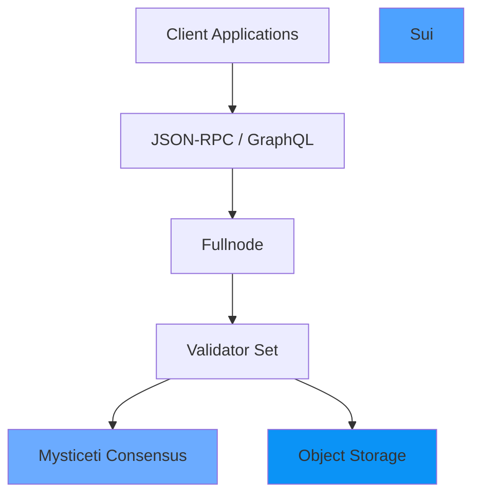

## What is Sui?

Sui is a next-generation smart contract platform with high throughput, low latency, and an asset-oriented programming model powered by the [Move programming language](https://github.com/MystenLabs/awesome-move).

<CardGroup cols={2}>
  <Card title="Quick Start" icon="rocket" href="/quickstart">
    Get started with Sui in minutes
  </Card>
  <Card title="Developer Guides" icon="code" href="/guides/setup-dev-environment">
    Build your first Move package
  </Card>
  <Card title="Run a Node" icon="server" href="/operators/fullnode-setup">
    Set up a fullnode or validator
  </Card>
  <Card title="API Reference" icon="book" href="/api/json-rpc-overview">
    Explore the JSON-RPC and GraphQL APIs
  </Card>
</CardGroup>

## Key Features

<AccordionGroup>
  <Accordion title="Unmatched Scalability" icon="gauge-high">
    Sui demonstrates capacity beyond the transaction processing capabilities of established systems. It's the first internet-scale programmable blockchain platform.
    
    - **Parallel execution**: Most transactions process in parallel
    - **Instant finality**: Sub-second transaction finality
    - **High throughput**: Scales with additional resources
  </Accordion>

  <Accordion title="Move Programming Language" icon="code">
    Smart contracts written in Move provide safety and expressiveness for managing digital assets.
    
    - **Asset-oriented**: Objects are first-class citizens
    - **Safe by design**: Prevents common security vulnerabilities
    - **Developer-friendly**: Clear syntax and powerful abstractions
  </Accordion>

  <Accordion title="Object-Centric Data Model" icon="cubes">
    Sui's object model enables flexible ownership and parallel transaction execution.
    
    - **Owned objects**: Fast-path execution without consensus
    - **Shared objects**: Coordinated updates via consensus
    - **Dynamic fields**: Extensible object storage
  </Accordion>

  <Accordion title="Delegated Proof-of-Stake" icon="shield-check">
    A permissionless set of validators secures the network through delegated stake.
    
    - **Byzantine fault tolerant**: Tolerates up to 1/3 faulty validators
    - **Epoch-based**: Regular validator set reconfiguration
    - **Staking rewards**: Incentivizes honest participation
  </Accordion>
</AccordionGroup>

## Use Cases

<CardGroup cols={2}>
  <Card title="DeFi" icon="coins">
    Build decentralized exchanges, lending protocols, and synthetic assets with programmable transaction blocks.
  </Card>
  <Card title="Gaming" icon="gamepad">
    Create on-chain games with fast finality, low latency, and composable game assets.
  </Card>
  <Card title="NFTs & Digital Assets" icon="palette">
    Mint and trade unique digital assets with flexible ownership models.
  </Card>
  <Card title="Payments" icon="credit-card">
    Power instant, low-cost payments at physical and online points of sale.
  </Card>
</CardGroup>

## Architecture Highlights



<Note>
  Sui makes the vast majority of transactions processable in parallel by using simpler and lower-latency primitives for common use cases like payment transactions and asset transfers.
</Note>

## Getting Started

<Steps>
  <Step title="Install Sui">
    Install the Sui CLI and development tools to start building.
    
    ```bash
    cargo install --locked --git https://github.com/MystenLabs/sui.git --branch main sui
    ```
  </Step>

  <Step title="Connect to a Network">
    Choose a network to connect to: devnet, testnet, or mainnet.
    
    ```bash
    sui client new-env --alias devnet --rpc https://fullnode.devnet.sui.io:443
    sui client switch --env devnet
    ```
  </Step>

  <Step title="Create Your First Project">
    Initialize a new Move package and start building.
    
    ```bash
    sui move new my_first_package
    cd my_first_package
    ```
  </Step>
</Steps>

## Community & Resources

<CardGroup cols={2}>
  <Card title="Documentation" icon="book-open" href="https://docs.sui.io">
    Comprehensive guides and references
  </Card>
  <Card title="Discord" icon="discord" href="https://discord.gg/sui">
    Join the community discussion
  </Card>
  <Card title="GitHub" icon="github" href="https://github.com/mystenlabs/sui">
    Explore the source code
  </Card>
  <Card title="Developer Grants" icon="hand-holding-dollar" href="https://sui.io/grants-hub">
    Apply for funding to build on Sui
  </Card>
</CardGroup>

## Next Steps

Ready to dive deeper? Here are some recommended paths:

<CardGroup cols={3}>
  <Card title="Why Choose Sui?" icon="question" href="/why-sui">
    Learn what makes Sui unique
  </Card>
  <Card title="Architecture" icon="diagram-project" href="/architecture-overview">
    Understand how Sui works
  </Card>
  <Card title="Install Sui" icon="download" href="/installation">
    Set up your development environment
  </Card>
</CardGroup>
