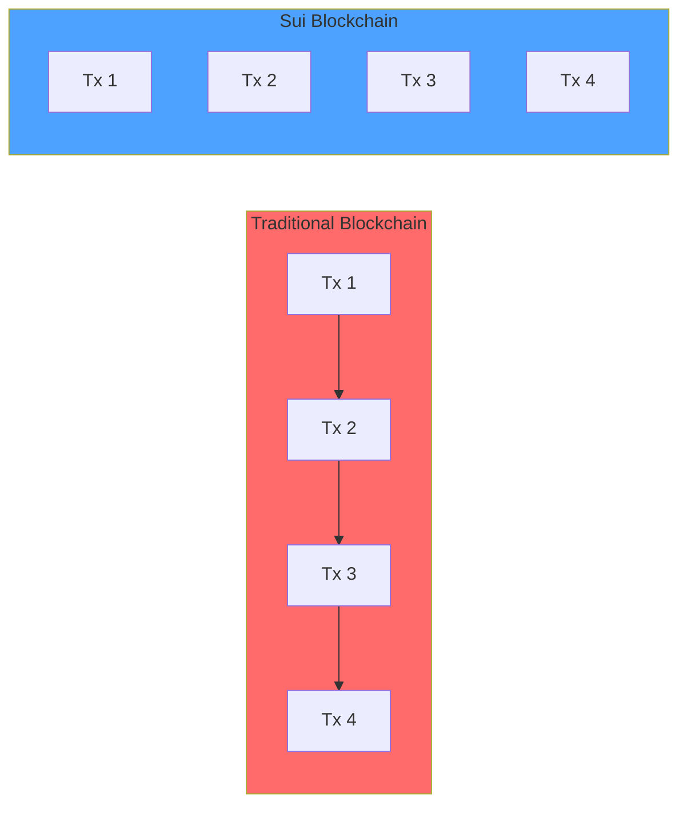

## The Sui Difference

Sui represents a fundamental rethinking of blockchain architecture, designed from the ground up to address the limitations of existing platforms.

<CardGroup cols={2}>
  <Card title="10x-100x Lower Latency" icon="gauge-high">
    Sub-second transaction finality for instant user experiences
  </Card>
  <Card title="Horizontal Scalability" icon="arrows-left-right">
    Add resources to increase throughput linearly
  </Card>
  <Card title="Lower Gas Costs" icon="dollar-sign">
    Efficient execution reduces transaction fees
  </Card>
  <Card title="Developer Friendly" icon="code">
    Move language prevents common vulnerabilities
  </Card>
</CardGroup>

## Unmatched Performance

### Parallel Transaction Execution

Unlike traditional blockchains that process transactions sequentially, Sui executes independent transactions in parallel.

<Note>
**Simple Transactions** bypass consensus entirely, achieving finality in ~400ms compared to 12+ seconds on Ethereum.
</Note>



### Fast-Path Execution

Owned objects (the majority of transactions) use the fast path:

1. **No Consensus Required**: Direct validator certification
2. **Instant Finality**: Certificate ready in one round-trip
3. **Low Latency**: Typically less than 500ms

<Tabs>
  <Tab title="Fast Path (Owned Objects)">
    ```
    Client → Validators (broadcast)
    Validators → Client (signatures)
    Client → Certificate (assembled)
    ✅ Transaction finalized
    
    Time: ~400ms
    ```
  </Tab>
  <Tab title="Consensus Path (Shared Objects)">
    ```
    Client → Validators
    Validators → Consensus (Mysticeti)
    Consensus → Order & Execute
    ✅ Transaction finalized
    
    Time: ~1-2 seconds
    ```
  </Tab>
</Tabs>

## Object-Centric Architecture

### Everything is an Object

Sui's data model treats all on-chain state as typed objects with unique IDs, owners, and version numbers.

<Info>
This approach enables fine-grained parallelism - transactions touching different objects execute simultaneously.
</Info>

**Object Types:**
- **Owned**: Single address owns (fast path)
- **Shared**: Multiple parties can access (consensus path)
- **Immutable**: Read-only, never changes
- **Wrapped**: Contained within another object

### Flexible Ownership Model

```move
// Owned object - transferred directly
public fun transfer_sword(sword: Sword, recipient: address) {
    transfer::transfer(sword, recipient);
}

// Shared object - accessible by anyone
public fun create_auction(ctx: &mut TxContext) {
    let auction = Auction { /* ... */ };
    transfer::share_object(auction);
}

// Immutable object - publish once, read forever
public fun freeze_metadata(metadata: Metadata) {
    transfer::freeze_object(metadata);
}
```

## Move Programming Language

### Built for Asset Safety

Move was designed at Meta (formerly Facebook) specifically for managing digital assets securely.

<CardGroup cols={2}>
  <Card title="Resource Safety" icon="shield-check">
    Assets can't be copied or accidentally destroyed
  </Card>
  <Card title="Type Safety" icon="check-circle">
    Strong typing catches errors at compile time
  </Card>
  <Card title="Formal Verification" icon="file-contract">
    Mathematical proofs of correctness
  </Card>
  <Card title="Auditable" icon="magnifying-glass">
    Clear, readable code structure
  </Card>
</CardGroup>

### Preventing Common Vulnerabilities

<Tabs>
  <Tab title="No Reentrancy">
    ```move
    // Move's borrow checker prevents reentrancy
    public fun withdraw(pool: &mut Pool, amount: u64): Coin<SUI> {
        // Can't call withdraw again while &mut Pool is borrowed
        pool.balance = pool.balance - amount;
        coin::split(&mut pool.reserves, amount, ctx)
    }
    ```
  </Tab>
  <Tab title="No Integer Overflow">
    ```move
    // Arithmetic operations panic on overflow
    public fun add_safely(a: u64, b: u64): u64 {
        a + b  // Automatically checked, panics if overflow
    }
    
    // Or use checked arithmetic
    public fun add_checked(a: u64, b: u64): Option<u64> {
        checked_add(a, b)  // Returns None on overflow
    }
    ```
  </Tab>
  <Tab title="Asset Ownership">
    ```move
    // Assets have clear ownership
    struct Coin<phantom T> has key, store {
        id: UID,
        balance: Balance<T>
    }
    
    // Can't be copied (no 'copy' ability)
    // Can't be dropped (no 'drop' ability)
    // Must be explicitly transferred or destroyed
    ```
  </Tab>
</Tabs>

## Programmable Transaction Blocks

### Compose Multiple Operations

Execute complex multi-step operations atomically in a single transaction.

```typescript
// TypeScript SDK example
const tx = new Transaction();

// 1. Split a coin
const [coin] = tx.splitCoins(tx.gas, [100_000_000]);

// 2. Call a Move function
const result = tx.moveCall({
  target: '0x2::coin::mint',
  arguments: [coin],
});

// 3. Transfer the result
tx.transferObjects([result], address);

// All succeed or all fail atomically
const result = await client.signAndExecuteTransaction({
  signer: keypair,
  transaction: tx,
});
```

<Tip>
PTBs can include up to 1,024 commands, enabling complex DeFi operations, batch NFT mints, and sophisticated game logic in a single transaction.
</Tip>

## Economic Model

### Storage Fund for Sustainability

Sui's storage fund ensures long-term economic sustainability.

<Steps>
  <Step title="Pay for Storage">
    Users pay a one-time storage fee when creating objects based on size.
  </Step>
  <Step title="Storage Fund Grows">
    Fees accumulate in the storage fund, generating staking rewards.
  </Step>
  <Step title="Rebates on Deletion">
    Users receive rebates when deleting objects, incentivizing cleanup.
  </Step>
</Steps>

### Gas Price Mechanism

<Accordion title="How Gas Pricing Works">
  - **Reference Gas Price**: Validators vote on minimum price each epoch
  - **Computation Gas**: Based on execution complexity
  - **Storage Gas**: Based on object size and duration
  - **Rebates**: Partial refunds when deleting objects
</Accordion>

## Network Architecture

### Mysticeti Consensus

Sui uses Mysticeti, a state-of-the-art DAG-based BFT consensus protocol.

<CardGroup cols={2}>
  <Card title="Low Latency" icon="clock">
    Commits in ~500ms (2-3 network round-trips)
  </Card>
  <Card title="High Throughput" icon="gauge">
    160,000+ TPS demonstrated in testing
  </Card>
  <Card title="Byzantine Fault Tolerant" icon="shield">
    Tolerates up to 1/3 malicious validators
  </Card>
  <Card title="Pipelining" icon="layer-group">
    Overlaps multiple rounds for efficiency
  </Card>
</CardGroup>

### Validator Set

- **Permissionless**: Anyone can become a validator with sufficient stake
- **Delegated PoS**: Token holders delegate stake to validators
- **Epoch-based**: Validator set reconfigures every 24 hours
- **Incentive-aligned**: Rewards tied to performance and uptime

## Developer Experience

### Rich Ecosystem

<CardGroup cols={3}>
  <Card title="Rust SDK" icon="rust" href="/api/rust-sdk/overview">
    Type-safe Rust client library
  </Card>
  <Card title="TypeScript SDK" icon="js" href="/guides/typescript-sdk">
    Full-featured JS/TS SDK
  </Card>
  <Card title="GraphQL API" icon="graphql" href="/api/graphql/overview">
    Rich query interface
  </Card>
  <Card title="CLI Tools" icon="terminal" href="/cli/overview">
    Comprehensive command-line tools
  </Card>
  <Card title="Move Analyzer" icon="code">
    IDE support via Language Server
  </Card>
  <Card title="Indexing" icon="database" href="/guides/indexing-data">
    PostgreSQL-based indexer
  </Card>
</CardGroup>

### Quick Iteration

```bash
# Create a new Move package
sui move new my_project

# Build and test locally
sui move build
sui move test

# Publish to devnet
sui client publish --gas-budget 100000000

# All in under 30 seconds
```

## Enterprise Features

### zkLogin

Authenticate users with Web2 credentials (Google, Facebook, Twitch) without compromising privacy.

<Info>
zkLogin uses zero-knowledge proofs to verify OAuth tokens on-chain without revealing user identity.
</Info>

### Sponsored Transactions

Allow applications to pay gas fees on behalf of users, enabling seamless onboarding.

```typescript
// App sponsors user's first transaction
const tx = new Transaction();
tx.setSender(userAddress);
tx.setGasOwner(sponsorAddress);

// Sponsor signs and submits
await sponsor.signAndExecuteTransaction({ transaction: tx });
```

### Multisig Support

Native support for multi-signature wallets and complex authorization schemes.

## Comparison

<Tabs>
  <Tab title="vs Ethereum">
    | Feature | Sui | Ethereum |
    |---------|-----|----------|
    | Finality | less than 500ms | 12-15 min |
    | TPS | 297,000+ | 15-20 |
    | Language | Move | Solidity |
    | Execution | Parallel | Sequential |
    | State Model | Object-based | Account-based |
  </Tab>
  <Tab title="vs Solana">
    | Feature | Sui | Solana |
    |---------|-----|--------|
    | Consensus | Mysticeti (BFT) | Proof of History + PBFT |
    | Finality | Instant | ~13 seconds |
    | Language | Move | Rust |
    | VM | Move VM | BPF/eBPF |
    | Validator Set | Permissionless DPoS | Permissionless PoS |
  </Tab>
  <Tab title="vs Aptos">
    | Feature | Sui | Aptos |
    |---------|-----|-------|
    | Language | Move (Sui dialect) | Move (Aptos dialect) |
    | Execution | Parallel (object-based) | Parallel (BlockSTM) |
    | Finality | less than 500ms (simple txs) | ~1 second |
    | State Model | Objects | Accounts + Objects |
    | Consensus | Mysticeti | AptosBFT |
  </Tab>
</Tabs>

## Get Started

<CardGroup cols={2}>
  <Card title="Install Sui" icon="download" href="/installation">
    Set up your development environment
  </Card>
  <Card title="Quickstart Tutorial" icon="rocket" href="/quickstart">
    Build and deploy your first package
  </Card>
  <Card title="Architecture Overview" icon="diagram-project" href="/architecture-overview">
    Understand how Sui works
  </Card>
  <Card title="Developer Guides" icon="book" href="/guides/setup-dev-environment">
    Comprehensive development guides
  </Card>
</CardGroup>
